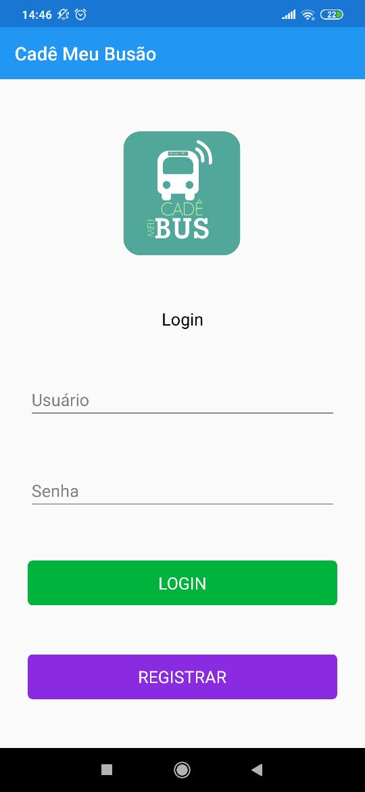
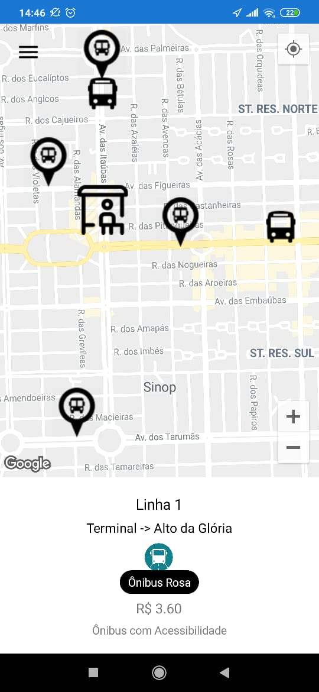
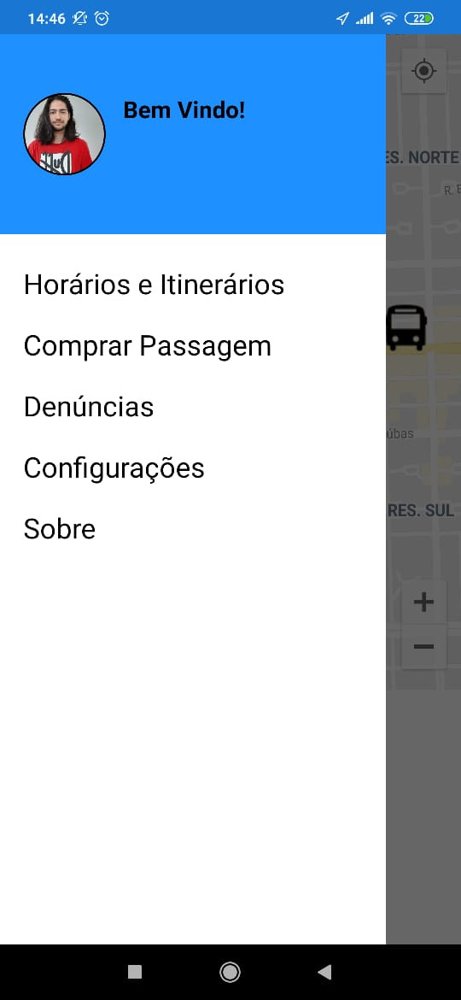
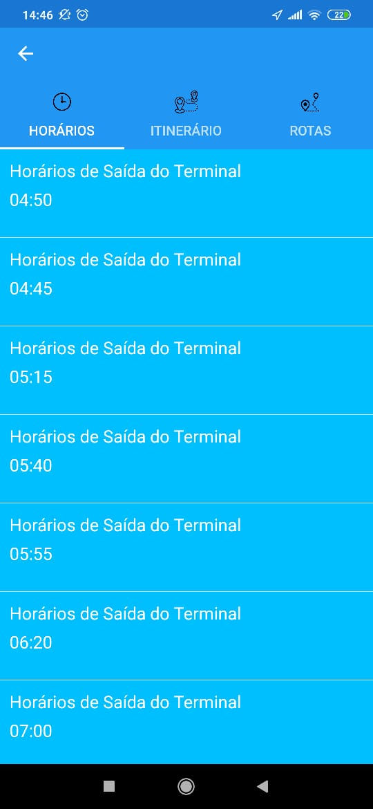
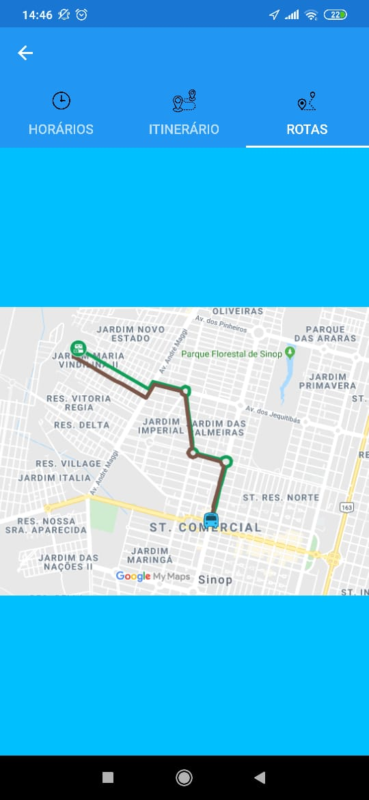
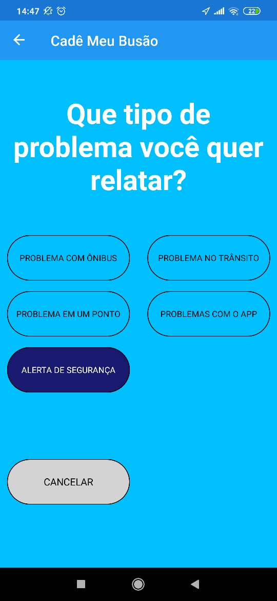

# CdMeuBus
<h1>Cadê Meu Busão using Xamarin Forms<h1>

<h2>Cadê Meu Busão is a public transportation app that shows real-time location and bus routes.<h2>
  
<h3>Screenshots<h3>
    
    
    
    

<h3>Tools Used:<h3>
  
*<b>Xam.Plugins.Forms.ImageCircle - Circle Images for your Xamarin.Forms Applications.<b>
https://github.com/jamesmontemagno/ImageCirclePlugin

*<b>CardsView - CardsView | CarouselView | CoverflowView | CubeView for Xamarin.Forms.<b>
https://github.com/AndreiMisiukevich/CardView

*<b>Xamarin.Forms.GoogleMaps - Map library for Xamarin.Forms using Google maps API<b>
https://github.com/amay077/Xamarin.Forms.GoogleMaps

*<b>PropertyChanged.Fody - Handles property changed events.<b>
https://github.com/Fody/PropertyChanged

